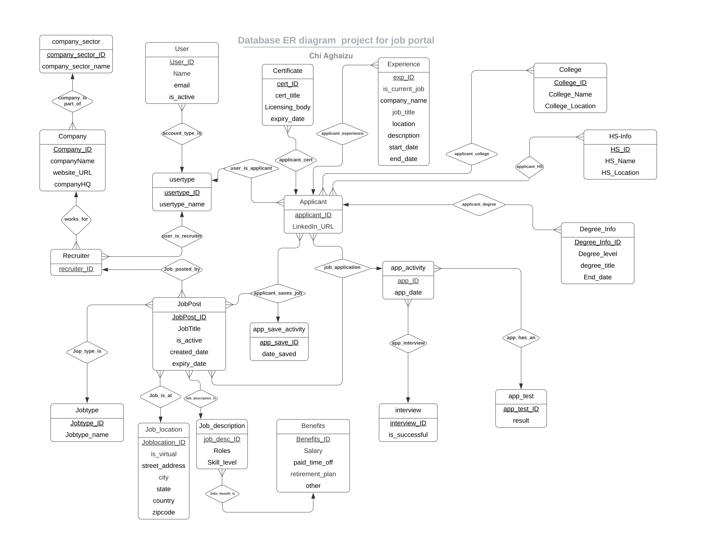

# JobHunt Inc. System Summary
Snowflake style Job board data model, with Entity Relationship Diagram

JobHunt Inc is a job search portal where users post jobs as recruiters, and other users can search for jobs of different kinds and apply for these jobs (as applicants). Recruiters can post unlimited jobs, and applicants have no limit on the jobs they apply to. The portal allows users to save or apply to a job. If the application is successful, the applicant will go through different stages: application test and then interview. A successful application may not have a test or interview (they could have one or the other) or both.

The main functionalities for the system are:
1. **Inputting data**: for user, applicant, recruiter, and job post.
2. **Search**: Job post search, company search, application activity information (when an applicant has applied), and applicant information for the recruiters.
3. **Delete**: user account information, applicant, recruiter, and job post.

# Snowflake Data Model Overview:

This project presents a robust snowflake data model designed to facilitate the management and organization of job-related information. The snowflake model extends the relational model by introducing increased normalization and complex hierarchies, providing a comprehensive system for job posts, applications, and interviews.

Key components of the snowflake data model include:

- **Job Post**: Represents a job posting with attributes such as job location, job description, and associated job benefits. Each job post is assigned a unique identifier and is not dependent on the company headquarters.

- **Application**: Represents a job application submitted by an applicant. It includes details such as application stage (app_test, app_interview), interview result, user type, and company sector. Each application is linked to a specific job post and can have only one interview.

- **Recruiter**: Represents a recruiter who handles job applications. Recruiters are associated with a single company and are identified by a unique recruiter_ID.

- **Applicant**: Represents an individual who applies for a job. Applicant profiles contain information such as degree_info, experience, and certifications. Each applicant is identified by a unique applicant_ID.

The snowflake data model also includes various relationships, such as the association between job posts and applications, recruiters and companies, and applicants and their respective profiles.

By adopting this snowflake data model, the project provides a structured and efficient framework for managing job-related data, enabling seamless communication and effective organization of information throughout the job application process.
   

# Entity Relationship Diagram

